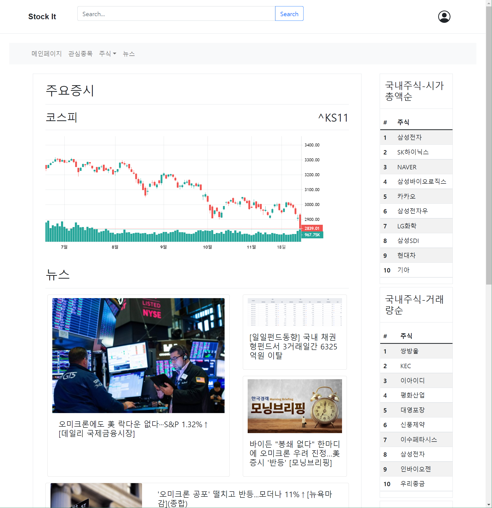

# StockIT
2021년도 2학기 웹프로그래밍_03 팀 프로젝트

<details open>
<summary style="font-size: x-large"> todo </summary>
<div markdown="1">

- [ ] 구현 완료하기
  - 12/2(목) 시연
  - 설계한 모든 사항을 구현하려 하기보다 페이지에 필수적인 항목들 위주로 구현하기
- [ ] 발표 ppt 제작
  - 11/29(월) 발표
- [ ] 보고서 작성
  - 아마 12/1(수) 자정까지 제출 (12/2(목) 수업시간 전까지 일수도)
  - 한컴 office web으로 작성할지 아니면 word로 작성할지 선택
    - 보고서 양식이 한글(.hwp) 포맷임

</div>
</details>

## WorkFlow
Feature Branch Workflow를 따릅니다.  
개발시에 각 기능별 혹은 사용자별로 `branch`를 만들어서 개발을 진행하고, `Pull request`를 통해 병합을 진행합니다.  
`Main` 브랜치에 직접적으로 `commit`하는 것을 피해주세요.  
자세한 사항은 아래 링크를 참조해주세요 
- [Git Feature Branch Workflow](https://www.atlassian.com/git/tutorials/comparing-workflows/feature-branch-workflow)  
- [Git을 이용한 협업 워크플로우](https://lhy.kr/git-workflow)의 2절  

## Compatibility
  
  


## Import to Eclipse
File > import > General > Projects from Folder or Archive

## 환경설정
### mysql
mysql jdbc 드라이버 다운로드후 `mysql-connector-java-8.x.x.jar`를  
`StockIT/WebContent/WEB-INF/lib/` 디렉토리에 위치시키기
- [mysql Connector/J 8.0.27](https://dev.mysql.com/downloads/connector/j/)

### mail
메일인증 위한 라이브러리
mail-1.4.7.jar와 activation-1.1.jar 다운 받아서 
두 jar파일 'StockIT/WebContent/WEB-INF/lib/' 경로에 위치시키기
(https://heodolf.tistory.com/99)  잘 실행되는 mail.jar, activation.jar 다운 가능

### cos.jar
프로필 수정란에서 선택한 이미지를 프로젝트 폴더에 저장하고, 필요할 때 접근하기 위해  
'cos-xx.xx.zip를 다운 후, 압축 해제 후에 lib 폴더 안 'cos.jar'를 
`StockIT/WebContent/WEB-INF/lib/` 디렉토리에 위치시키기
- [cos-20.08.zip](http://www.servlets.com/cos/)

### jsoup
웹 페이지를 크롤링 하기 위한 라이브러리
jsoup-1.14.x.jar 파일을 다운로드 받고,   
파일을 `StockIT/WebContent/WEB-INF/lib/` 디렉토리에 위치시키기
- [jsoup hompage](https://jsoup.org)
- [jsoup-1.14.3.jar](https://jsoup.org/packages/jsoup-1.14.3.jar)

## 데이터 베이스와 테이블
> 각자 테이블 생성에 사용한 쿼리문을 공유해주시면 좋을것 같습니다.
- 데이터베이스 명 : stockit
- 테이블 명 
- user --> userID(primary key, not null), userPassword(not null), userName, userEmail
- image --> userID(primary key, not null), filename, filerealname
- news --> NewsId(primary key, not null auto_increment), link(not null), title(not_null), imgPath

### 유저 정보 데이터베이스
```sql
create table user(
                     userId varchar(64) primary key not null,
                     userPassword varchar(64),
                     userName varchar(64),
                     userEmail varchar(64)
);
```
### 유저 프로필 이미지 데이터베이스
```sql
create table image(
                     userId varchar(64) primary key not null,
                     filename varchar(256),
                     filerealname varchar(256)
);
```

### 뉴스 데이터베이스
중복된 뉴스를 크롤링하는 것을 방지하기 위해 테이블 구조를 수정했습니다.  
이전에 뉴스 테이블을 생성한 경우 꼭 테이블을 다시 생성해주세요.  
- [x] ~~뉴스 크롤링하는 시스템 추가.~~ 뉴스 크롤링 시스템 추가 완료
```sql
create table news(
                     newsId int auto_increment primary key not null ,
                     link varchar(256) unique not null ,
                     title varchar(128) not null ,
                     imgPath varchar(128) null
);
```

### 주식 데이터베이스
주식에 대한 기본적인 데이터들을 저장한 테이블  
이후 수정될 수도 있음.
- 현재 csv 파일에서 데이터를 데이터베이스에 저장하는 방식을 사용하고 있음.  
   - ReadCsv.java 52번 라인에 있는 main을 주석 해제하고 실행하여 데이터 삽입.
   - csv 파일 출처:
      - [Nasdaq](https://www.nasdaq.com/market-activity/stocks/screener)  
      - [한국거래소](http://data.krx.co.kr/contents/MDC/MAIN/main/index.cmd)
```sql
create table stock(
                    Symbol varchar(64) primary key not null,
                    Market varchar(16) not null,
                    Name varchar(256) not null,
                    LastSale numeric(10,2),
                    MarketCap numeric(32),
                    Country varchar(32),
                    Volume numeric(16)
);
```
### 관심종목 데이터베이스
관심종목에 대한 데이터들을 저장한 테이블
한 종목에대한 모든 정보를 저장하는것은 비효율이라고 판단하여 유저 아이디와 종목코드만을 저장
로그인한 아이디 세션을 통해 select하여 그 아이디가 가진 모든 종목코드를 가져올수 있도록 만듬 

현재 똑같은 아이디와 종목을 가진 행이 중복될수 있음
같은 아이디는 여러번 저장될수 있도록하면서 한 아이디당 같은 종목코드는 한번만 저장되도록 만들고 싶은데 해결책이 필요함
```sql
create table interest(
                    userId varchar(64),
                    symbol varchar(64)
);
```

## 주식 차트
### 주식 api
> 12월 1일 00시 01분 기준 219/500    

rapid api의 YH Finance api를 사용하였음.  
우선 개인 계정으로 api 키를 발급받았는데 500 request/month 여서 api사용에 주의할것.  
만약 api 사용 회수가 한계에 가까워지면 프로젝트 제출시에 새 api키를 발급받아 수정해야 함.   
또 YH Finance api의 historical data가 과거 1년치의 데이터만을 제공하고 있는 듯 해서 그 이전의 그래프는 띄울 수 없음.   
[YH Finance api](https://rapidapi.com/apidojo/api/yh-finance/)   
### 주식 차트 사용법
`stock-chart.jsp`페이지를 삽입하고 파라미터 `width`, `height`, `ticker`를 설정한다.  
`width` : 차트 넓이  
`height`: 차트 높이  
`ticker`: 주식 종목 코드   
서브페이지 기능상의 문제로 한 페이지에 2개 이상의 차트를 넣는것은 어려운것 같음.  
만약 2개 이상의 차트가 필요한 경우 직접 코드를 삽입해야 함.
```html
<!-- Example -->
<c:import url="stock-chart.jsp">
    <c:param name="width" value="document.getElementById('stock-chart-container').clientWidth"></c:param>
    <c:param name="height" value="300"></c:param>
    <c:param name="ticker" value="^KS11"></c:param>
</c:import>
```

## 주식 세부정보
### 주식 api
주식 차트에 사용한 api와 다른 api 사용함.   
[Stock Data - Yahoo Finance Alternative](https://rapidapi.com/principalapis/api/stock-data-yahoo-finance-alternative/)
> api의 무료 request 횟수를 최대한 적게 사용하기 위해 api를 분산하여 사용함.   

- 기존 주식 세부정보 항목들중 상한가, 하한가의 경우 미국 주식에는 존재하지 않고 있어서 삭제함.
- 주식 차트를 일, 주, 년 등에 따라 변경하는 버튼 또한 차트에서 마우스 드래그 및 스크롤로 제공하는 기능이어서 제거함.
- 그 외에도 주식 세부정보중 api로 얻을수 있고, 실제 투자의 지표가 되는 항목들을 추가하고, 일부 항목 제거함  

## 메일인증
SMTPAuthenticator.java의 getPasswordAuthentication 메서드에 메일을 발송할 관리자의 메일과 비밀번호 작성필요

sendMail.jsp의 
String host = ""; 각자 구현한 웹사이트 주소 작성필요  
String from = ""; 메일을 발송할 메일주소 작성필요, gmail로만 메일 발송가능 

---
## 구현 화면
### 메인 페이지

### 뉴스 페이지

### 로그인 페이지

### 검색

